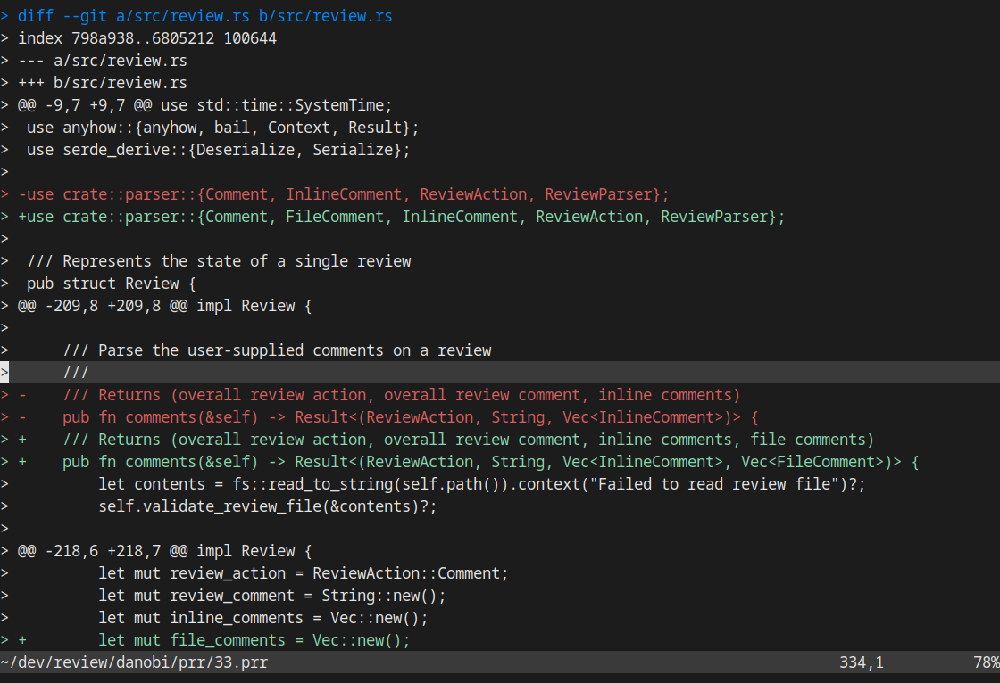

# Introduction

`prr` is a tool that brings mailing list style code reviews to Github PRs.
This means offline reviews and a file oriented interface, more or less.

To that end, `prr` introduces a new workflow for reviewing PRs:

1. Download the PR into a "review file" on your filesystem
1. Mark up the review file using your favorite text editor
1. Submit the review at your convenience

When run from within a git repository on a branch associated with a PR, `prr`
can auto-detect the repository and PR number—just run `prr get`, `prr edit`,
or `prr submit` without arguments. This works with fork workflows too.

The tool was born of frustration from using the point-and-click editor text
boxes on PRs. I happen to do a lot of code review and tabbing to and from the
browser to cross reference code from the changes was driving me nuts.

