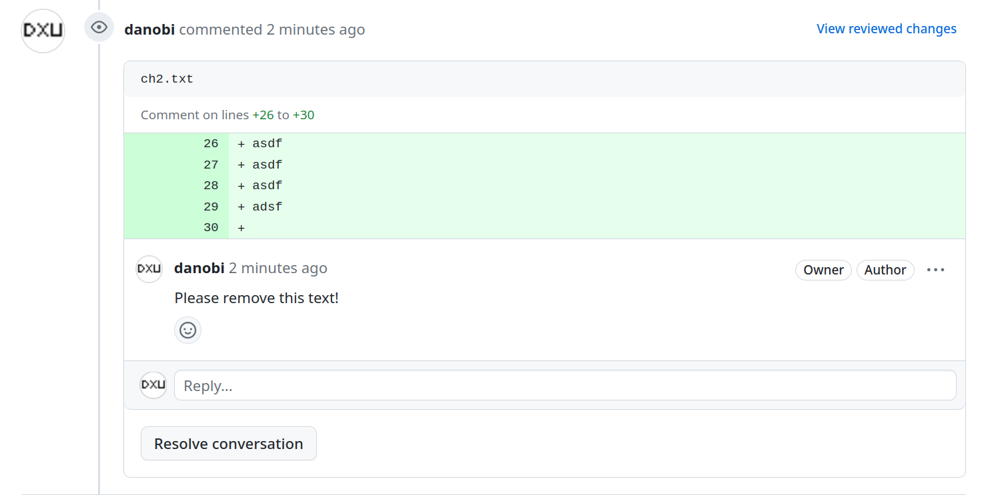

# Tutorial

This tutorial shows you how to create a review against
[prr-test-repo#6][0]. Feel free to review it!

We assume you've followed all the instructions in
[Installation](./install.md).

### Download the PR

First, let's download a PR:

```sh
$ prr get danobi/prr-test-repo/6
/home/dxu/dev/review/danobi/prr-test-repo/6.prr
```

`prr-get` downloads a pull request onto your filesystem into what we call a
"review file". On success, the path to the review file is printed to your
terminal.

But to be sure, let's check our status:

```sh
$ prr status
Handle                  Status     Review file
danobi/prr-test-repo/6  NEW        /home/dxu/dev/review/danobi/prr-test-repo/6.prr
```

Great! We've confirmed the review was downloaded.

### Mark up the review file

Now that the review file is downloaded, let's mark it up. You can open
the review file in your favorite editor or use `prr-edit` to automatically
open it in `$EDITOR`.

```
$ prr edit danobi/prr-test-repo/6
```

Your editor should show the contents as something like this:

```
> diff --git a/ch2.txt b/ch2.txt
> index 4d729e6..2641120 100644
> --- a/ch2.txt
> +++ b/ch2.txt
> @@ -2,13 +2,6 @@ CHAPTER 2. WAGING WAR
>
>  1.  Sun Tzu said: In the operations of war, where there are in the field a thousand swift chariots, as many heavy chariots, and a hundred thousand mail-clad soldiers, with provisions enough to carry them a thousand LI, the expenditure at home and at the front, including entertainment of guests, small items such as glue and paint, and sums spent on chariots and armor, will reach the total of a thousand ounces of silver per day. Such is the cost of raising an army of 100,000 men.
>
> -2. When you engage in actual fighting, if victory is long in coming, then men's weapons will grow dull and their ardor will be damped. If you lay siege to a town, you will exhaust your strength.
> -
> -3. Again, if the campaign is protracted, the resources of the State will not be equal to the strain.
> -
> -4. Now, when your weapons are dulled, your ardor damped, your strength exhausted and your treasure spent, other chieftains will spring up to take advantage of your extremity. Then no man, however wise, will be able to avert the consequences that must ensue.
> -
> -5. Thus, though we have heard of stupid haste in war, cleverness has never been seen associated with long delays.
>
>  6. There is no instance of a country having benefited from prolonged warfare.
>
> @@ -30,6 +23,11 @@ CHAPTER 2. WAGING WAR
>
>  16. Now in order to kill the enemy, our men must be roused to anger; that there may be advantage from defeating the enemy, they must have their rewards.
>
> +asdf
> +asdf
> +asdf
> +adsf
> +
>  17. Therefore in chariot fighting, when ten or more chariots have been taken, those should be rewarded who took the first. Our own flags should be substituted for those of the enemy, and the chariots mingled and used in conjunction with ours. The captured soldiers should be kindly treated and kept.
>
>  18. This is called, using the conquered foe to augment one's own strength.
```

There's a lot of diff we don't particularly care about. So let's snip away the
top portion.  We can do this by replacing as many contiguous lines as we want
with `[...]`.

After snipping your review file will look exactly like this:

```
[...]
> @@ -30,6 +23,11 @@ CHAPTER 2. WAGING WAR
>
>  16. Now in order to kill the enemy, our men must be roused to anger; that there may be advantage from defeating the enemy, they must have their rewards.
>
> +asdf
> +asdf
> +asdf
> +adsf
> +
>  17. Therefore in chariot fighting, when ten or more chariots have been taken, those should be rewarded who took the first. Our own flags should be substituted for those of the enemy, and the chariots mingled and used in conjunction with ours. The captured soldiers should be kindly treated and kept.
>
>  18. This is called, using the conquered foe to augment one's own strength.
```

Looks like someone is trying to ruin a classic text with gibberish! Let's tell them to remove it:

```
[...]
> @@ -30,6 +23,11 @@ CHAPTER 2. WAGING WAR
>
>  16. Now in order to kill the enemy, our men must be roused to anger; that there may be advantage from defeating the enemy, they must have their rewards.
>

> +asdf
> +asdf
> +asdf
> +adsf
> +

Please remove this text!

[...]
```

Here we've done two things:

1. Create a "spanned inline" comment that attaches our comment to a block of
   lines. If we omitted the leading newline, we would have a regular "inline"
   comment that attaches to the most immediately quoted line. Using spanned
   inline comments can be useful when we want to be precise during review.
1. Snip the trailing text. We didn't have to do this, but it makes the example
   a little clearer.

### Submit the review

Now that we're done with our review, it's time to submit it to Github.
Do this by running:

```sh
$ prr submit danobi/prr-test-repo/6
```

On success there will not be any output. But just to be safe, let's confirm
submission status:

```sh
$ prr status
Handle                  Status     Review file
danobi/prr-test-repo/6  SUBMITTED  /home/dxu/dev/review/danobi/prr-test-repo/6.prr
```

Looks like it made it to the web interface as well:



### Homework

Try figuring out how to "request changes" on the PR!

[0]: https://github.com/danobi/prr-test-repo/pull/6
